# Lag Compensator Control System Design

This project presents the **complete design and implementation of a lag compensator for a control system**, including theoretical analysis, MATLAB/Simulink modeling, analog circuit realization, PCB design, and experimental hardware validation.

The objective of the project is to demonstrate the **full engineering workflow of a control system**, starting from theoretical control analysis and ending with a fully operational analog circuit verified through laboratory experiments.

Unlike purely theoretical studies, this project follows a **complete design pipeline**, proving that the control algorithm can be successfully implemented as a real physical electronic system.

---

# Project Objectives

The primary objectives of this project are:

• Analyze a control system using classical control theory  
• Design a lag compensator to improve steady-state performance  
• Model and simulate the system in MATLAB / Simulink  
• Implement the control system as an analog circuit in LTspice  
• Design a manufacturable PCB layout  
• Build and solder the circuit on a perforated copper board  
• Validate the results through laboratory experiments  

The project demonstrates the transition from **control theory → simulation → hardware realization**.

---

# Engineering Workflow

The entire development process followed the engineering pipeline below:

Control System Analysis  
→ Lag Compensator Design  
→ MATLAB / Simulink Simulation  
→ LTspice Analog Circuit Implementation  
→ PCB Design  
→ Hardware Construction  
→ Laboratory Testing  
→ Experimental Verification

This workflow reflects the typical development process used in real control system engineering.

---

# Control System Theory

Control systems are widely used in engineering to regulate and stabilize dynamic systems. However, many systems suffer from **steady-state errors or insufficient low-frequency gain**, which reduces tracking accuracy.

To solve this problem, compensators are used to modify the system dynamics.

A **lag compensator** is particularly effective for improving steady-state performance without significantly affecting system stability.

The general transfer function of a lag compensator is:

Gc(s) = (s + z) / (s + p)

where

z > p

The lag compensator increases the low-frequency gain of the system, thereby reducing steady-state error.

---

# Lag Compensator Design

The compensator design process consisted of the following steps:

1. Analyze the uncompensated system response  
2. Determine required steady-state performance improvement  
3. Select appropriate compensator pole and zero locations  
4. Verify system stability  
5. Validate performance through simulation  

The lag compensator shifts the system response by increasing the low-frequency gain while maintaining acceptable transient behavior.

---

## Quantitative Performance Analysis

In addition to theoretical and simulation-based analysis, the effect of the lag compensator was also evaluated quantitatively.

The main objective of the compensator was to **reduce steady-state error while maintaining system stability**.

### Steady-State Error Calculation

The steady-state error for a ramp input is defined as:

e_ss = 1 / Kv

where Kv is the velocity error constant.

For the uncompensated system:

Kv_uncompensated = 3.1  
e_ss_uncompensated = 1 / 3.1  
e_ss_uncompensated ≈ 0.32

After introducing the lag compensator, the low-frequency gain increased:

Kv_compensated = 20  
e_ss_compensated = 1 / 20  
e_ss_compensated = 0.05

### Error Reduction

The improvement achieved by the lag compensator is:

Error Reduction = (0.32 − 0.05) / 0.32

Error Reduction ≈ 0.84

This corresponds to approximately:

**84% reduction in steady-state error**

---

### Numerical Performance Comparison

| Performance Metric | Uncompensated System | Lag Compensated System |
|--------------------|---------------------|------------------------|
| Velocity Constant Kv | 3.1 | 20 |
| Steady-State Error | 0.32 | 0.05 |
| Error Reduction | — | 84% |
| Tracking Accuracy | Limited | Significantly Improved |

---

### Interpretation of Results

The lag compensator successfully increases the system's low-frequency gain while keeping the transient response within acceptable limits.

As a result:

• steady-state error is significantly reduced  
• ramp tracking performance is improved  
• overall system accuracy increases  

Both **MATLAB/Simulink simulations** and **LTspice circuit simulations** confirm these theoretical predictions.

Furthermore, the experimental hardware tests conducted in the laboratory environment showed behavior consistent with the simulation results.

This confirms that the designed lag compensator is effective not only in theory but also in real physical implementation.
---

# MATLAB / Simulink Modeling

The control system was first modeled and simulated in **MATLAB / Simulink**.

This stage allowed observation of the system behavior before implementing the circuit physically.

Two system configurations were simulated:

• Uncompensated system  
• Lag compensated system

The simulation provided valuable insight into the improvement achieved by the compensator.

---

## Simulink Model

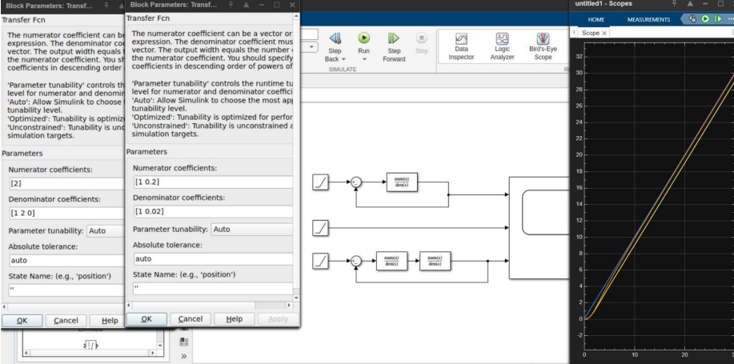

---

## Step Response Analysis

The step response demonstrates how the system reacts to a sudden input change.

The compensated system shows improved steady-state accuracy.

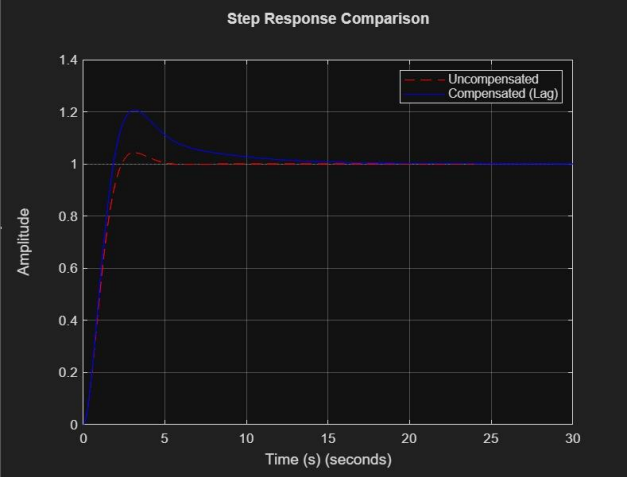

---

## Ramp Response Analysis

Ramp response analysis evaluates the system's ability to track continuously changing inputs.

The lag compensator significantly reduces steady-state tracking error.

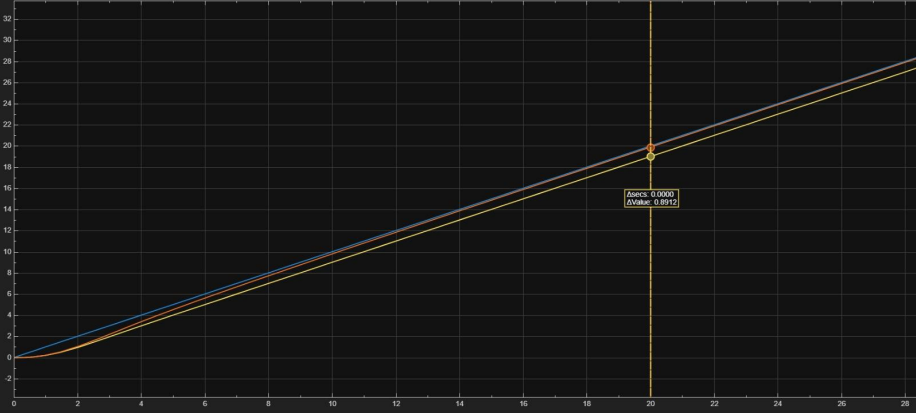

---

# Analog Circuit Design

After verifying the control system behavior through simulation, the next step was to implement the compensator as an **analog electronic circuit**.

Operational amplifiers were used to realize the transfer function of the compensator.

The circuit was designed and analyzed using **LTspice**.

---

## LTspice Circuit Implementation

The compensator was implemented using op-amp based active filter configurations.

The circuit includes:

• Operational amplifiers  
• Resistors  
• Capacitors  

These components form the required transfer function of the lag compensator.

---

## Uncompensated Circuit

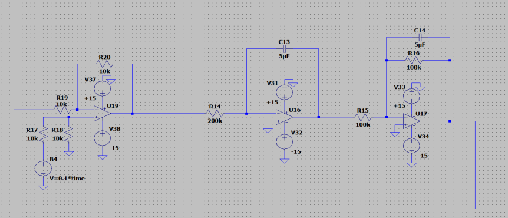

---

## Compensated Circuit

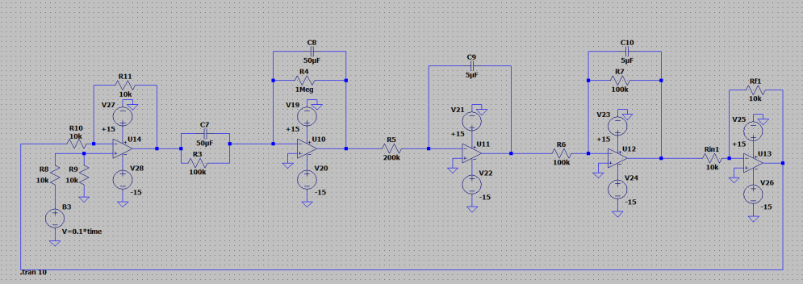

---

## LTspice Step Response

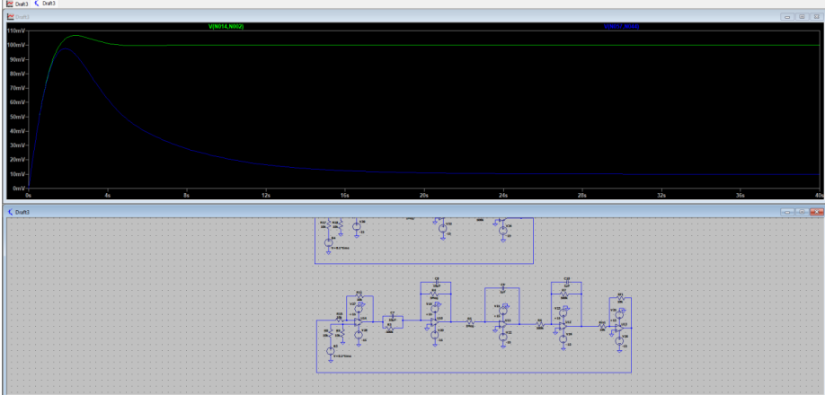

---

## LTspice Ramp Response

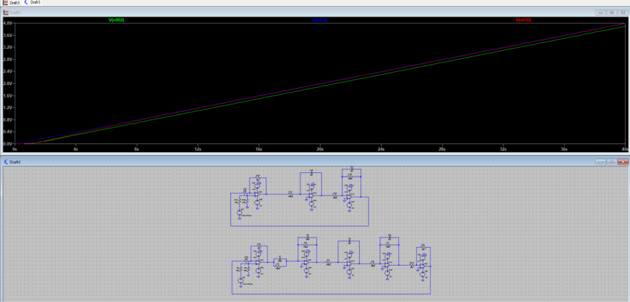

---

# PCB Design

After validating the analog circuit, the design was transferred into a **PCB layout** to create a manufacturable board.

The PCB layout stage involved:

• component placement  
• signal routing  
• power line design  
• physical layout optimization  

---

## Uncompensated PCB Layout

### 2D View

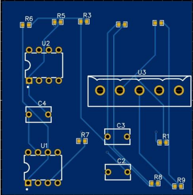

### 3D View

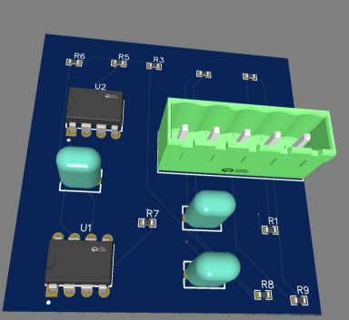

---

## Compensated PCB Layout

### 2D View

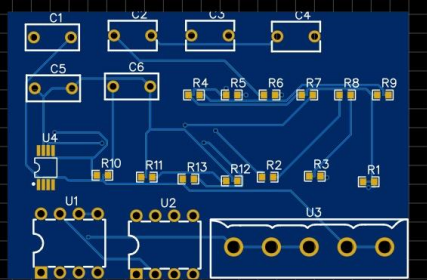

### 3D View

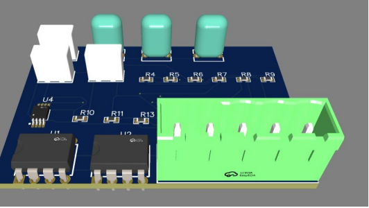

---

# Hardware Implementation

After completing the design stages, the circuit was physically constructed and tested.

The hardware development progressed through several stages:

1. Breadboard prototyping  
2. Early development testing  
3. Perfboard circuit construction  
4. Laboratory experiments  

---

## Breadboard Prototype

The circuit was initially assembled on a breadboard to verify connectivity and component behavior.

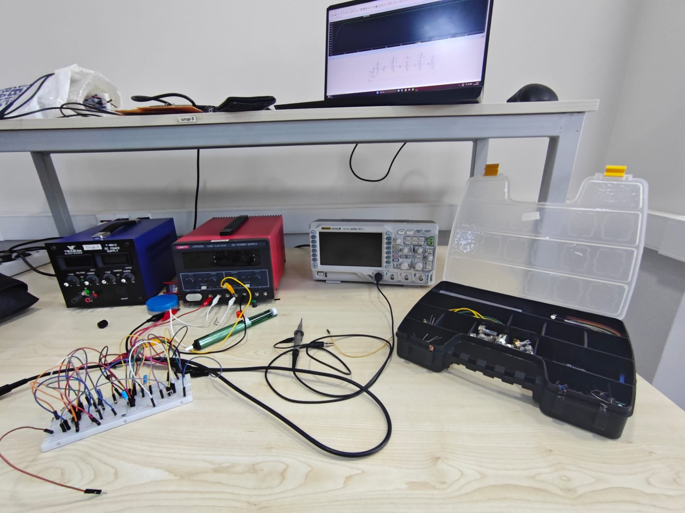

---

## Early Development Testing

Additional testing was conducted during the early development phase to analyze signal behavior.

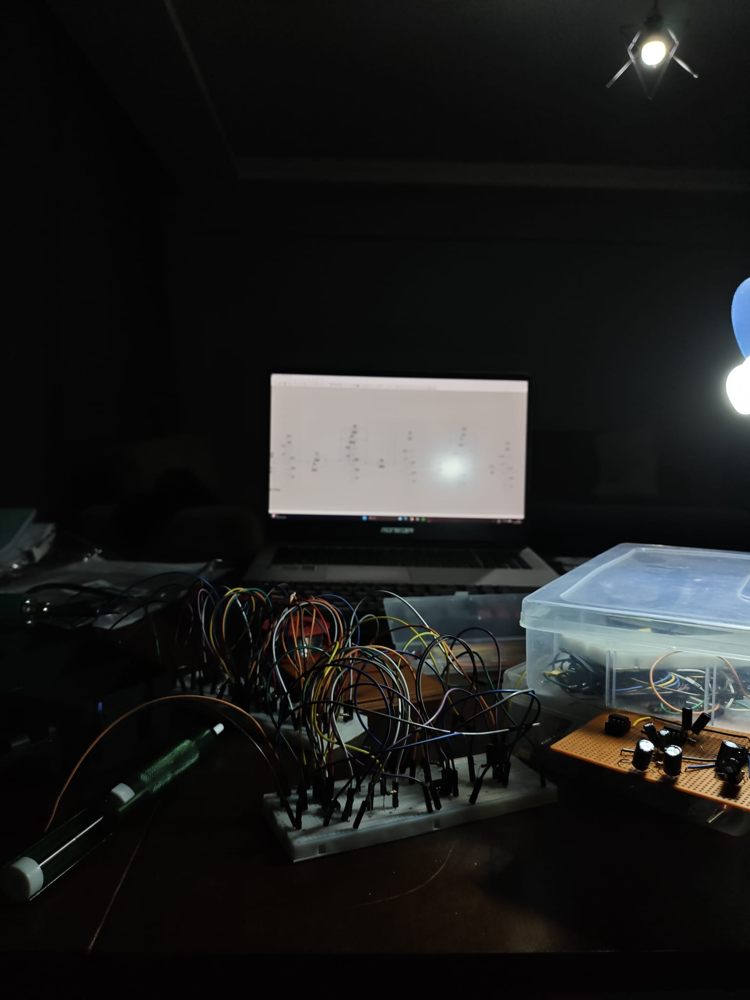

---

## Circuit Construction

The final circuit was constructed on a **perforated copper board (perfboard)** and soldered manually.

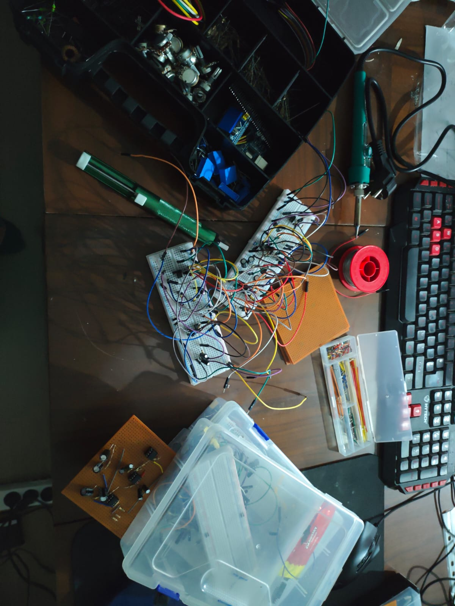

---

## Final Hardware Circuit

The fully assembled lag compensator circuit.

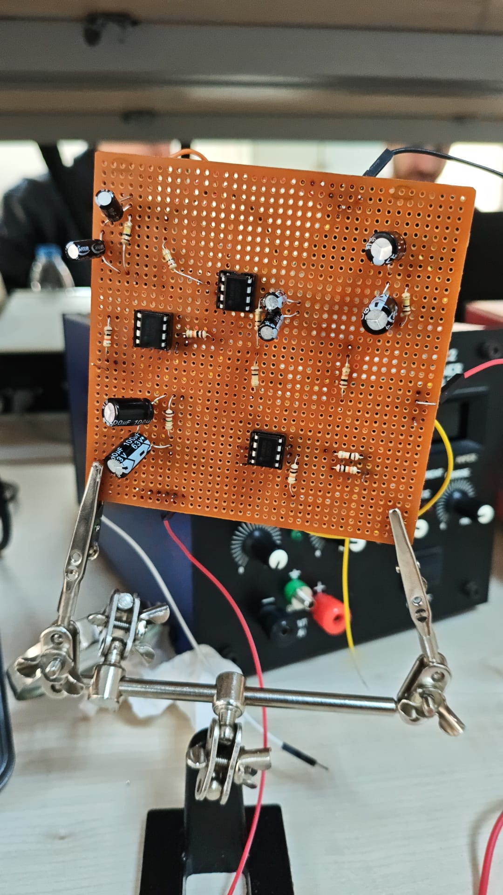

---

# Laboratory Experiments

The hardware system was tested in a laboratory environment using professional measurement instruments.

The test setup included:

• Function generator  
• Oscilloscope  
• DC power supply  

---

## Initial Laboratory Test

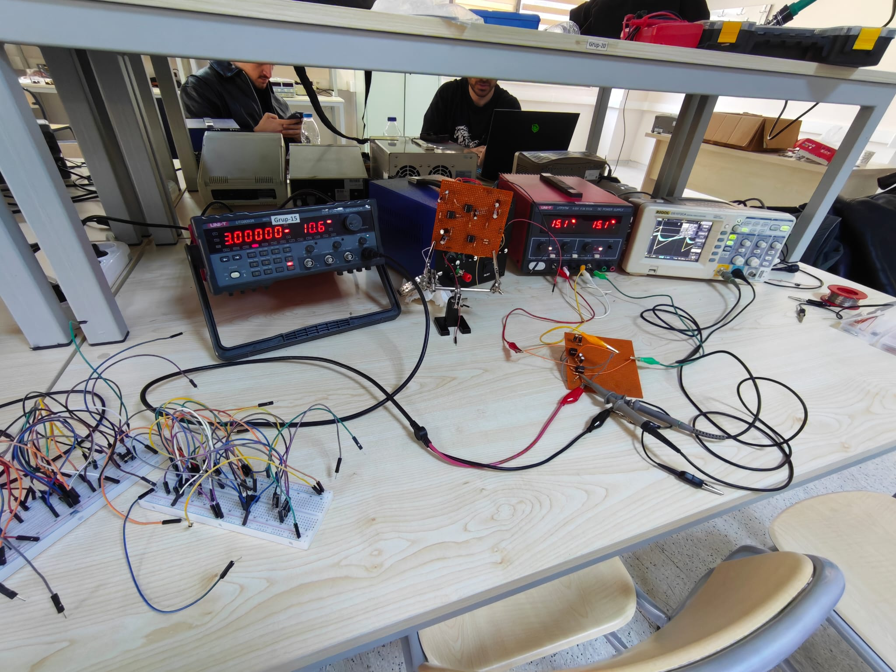

---

## Final System Comparison

The final experiment compared the uncompensated and compensated systems.

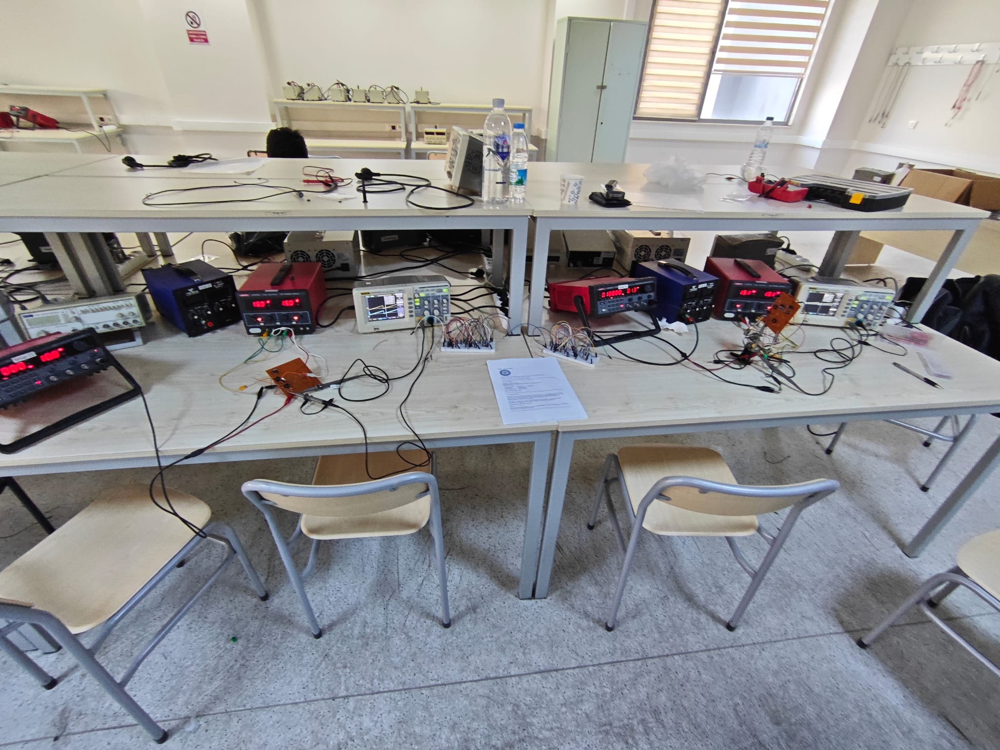

---

# Experimental Results

The experimental results confirmed that the lag compensator improved the system performance.

Key observations:

• Reduced steady-state error  
• Improved tracking accuracy  
• Consistency between simulation and hardware behavior  

The results demonstrate that the designed compensator functions correctly when implemented as a real analog circuit.

---

# Tools and Technologies Used

MATLAB  
Simulink  
LTspice  
Analog Electronics  
Operational Amplifiers  
PCB Design Tools  

---

# Conclusion

This project successfully demonstrates the complete design cycle of a control system.

Starting from theoretical analysis and ending with hardware validation, the lag compensator was implemented and tested as a real physical system.

The experimental results confirmed the accuracy of the simulations and validated the effectiveness of the compensator.

The project highlights the importance of integrating **control theory, simulation tools, circuit design, and hardware implementation** in modern engineering workflows.
